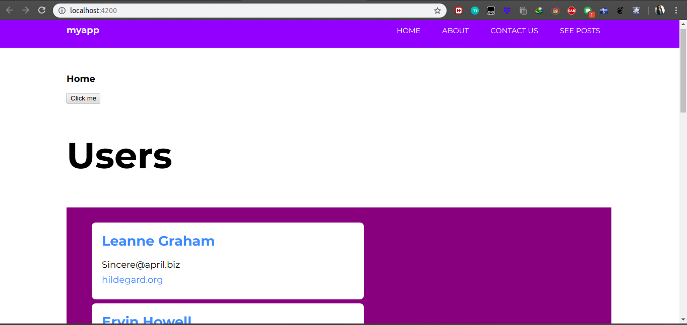
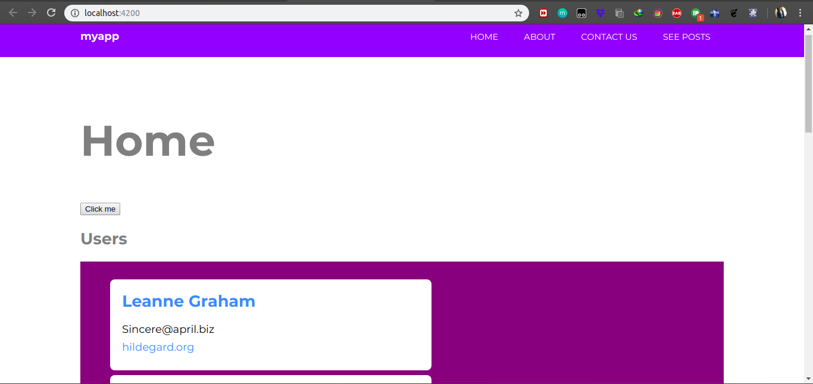
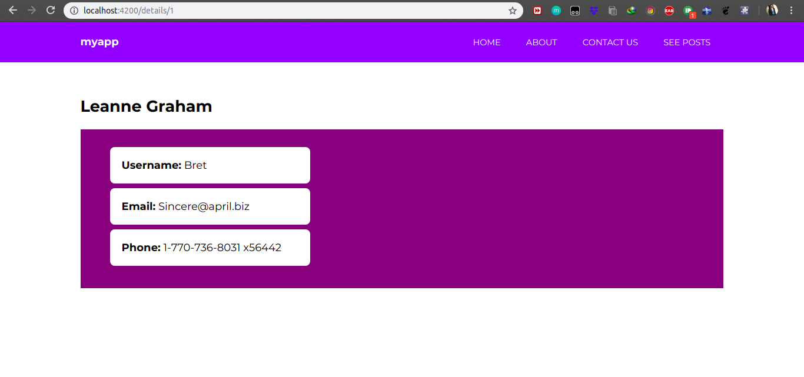
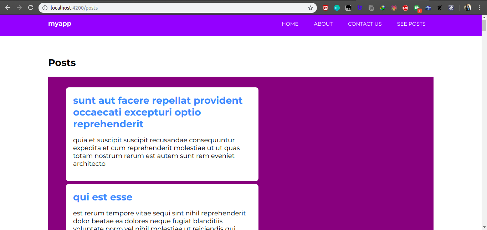
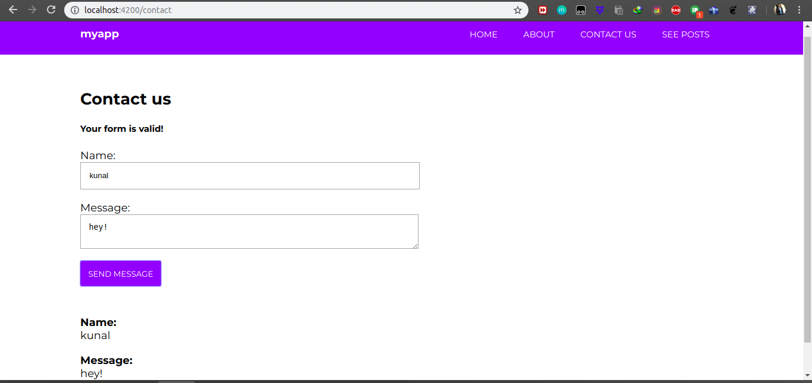

# Ng7Pre
Learning Basics of Angular 7 from https://coursetro.com/posts/code/171/Angular-7-Tutorial---Learn-Angular-7-by-Example

**Using Http Client module and services,I retrieved _users, user's details and user's posts_ from https://jsonplaceholder.typicode.com/**

**Click me button does style binding on "Home" and class binding on "Users"**

**Clicking on user's name leads to that(using user id) user's details page**

**The See Posts page**

**The Form that does validation and displays the message**

